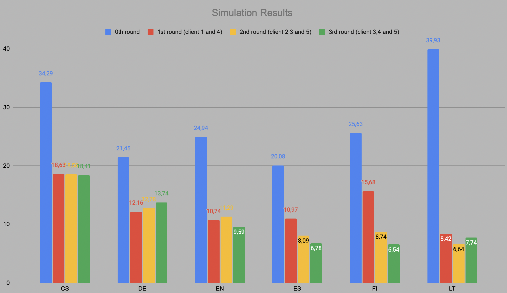

# Pretrained-Models-for-Multilingual-Federated-Learning
In this repo, you will find a simplified implementation of federated learning for multilingual language models using flower framework. You may find the details in the paper cited below.
To better understand the timing, I run this simulation with `distilbert-base-multilingual-cased`, `6 clients`, `1 local epoch` and `3 server rounds` on 4 Tesla A100 GPU and it took about a day to complete. You may also see the results down below.



### Steps to Recreate Data
1. `bash download_files.sh` will download and unzip the tar files
2. `python clean_and_split_data.py` to sample data for training, dev, and testing
3. `bash copy_to_data_folder.sh` to move them to the `data` folder
---
After creating your data, from your terminal, create your virtual environment and simply run `flwr run .`

### CITATION
```
@inproceedings{Weller2022PretrainedMF,
  title={Pretrained Models for Multilingual Federated Learning},
  author={Orion Weller and Marc Marone and Vladimir Braverman and Dawn J Lawrie and Benjamin Van Durme},
  booktitle={Proceedings of the 2022 Conference of the North American Chapter of the Association for Computational Linguistics: Human Language Technologies (NAACL-HLT)},
  year={2022}
}
```
---
I also highly recommend you the Flower's tutorial video series
[](https://youtube.com/playlist?list=PLNG4feLHqCWkdlSrEL2xbCtGa6QBxlUZb&si=IVbQyoJG4s7ovPuV)
to better understand the concepts and push your knowledge even further.
---
Feel free to contribute or reach out. peace✌🏼
